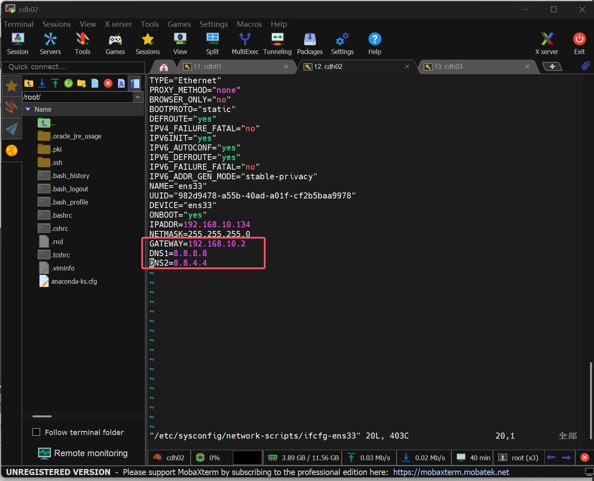
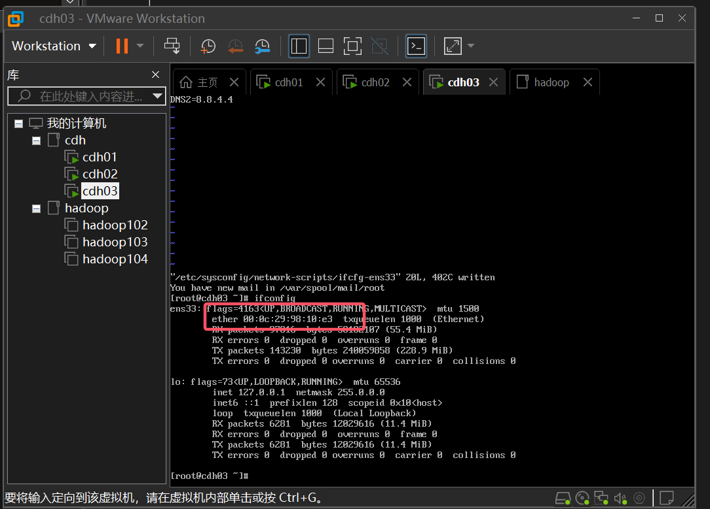

### CDH搭建
* 其中遇见了时间跟管理页面对不上的问题,也是通过修改/etc/sysconfig/network-scripts/ifcfg-ens33中的DNS解决时间问题
* 在通过修改/etc/sysconfig/network-scripts/ifcfg-ens33中的DNS时遇见端口号变成乱码,MobaXterm连接不上,通过从新修改以及刷新,乱码的问题也成功的被解决了(没有从根本上解决问题,暂时没有找到具体原因)
  
* 还有CDH中给的内存而提示的警告,只要根据CDH给的提示修改即可
* 有时候你更改数据源后还是无法下载东西,可以备份后再次进行修改也可能是你本地网络配置错误