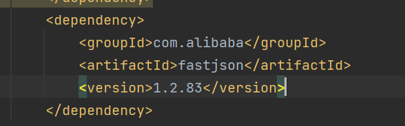

### dim层优化问题
* 在运行的时候遇到创表不全问题(暂时没找到问题)
* 在Hbase中查询数据的时候可以使用(必须是大写)
* 遇见在插入数据的时候报null值和主键问题,所以在创建MySQL表的时候一定要指定主键id
* 在部署yarn的时候遇见缺少pred,那样得重新加载主类pom
* 对代码的理解不够到位,写的多的话可以熟练,目前经验太少 
### 日志信息处理
* 将日志数据存入到了不同的topic主题中,其中遇见了依赖冲突问题
* 原本是2.0.0版本,我给降低了
* 然后上传kafka的时候,遇到了储存类型时存入的是地址,最后是我不会调用存入kafka的方法(少了sinkto)
