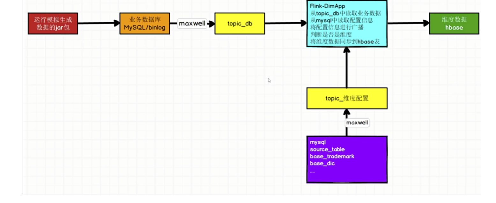

# 实时数仓

## 日志信息采集

思路:运行jar包会生成一个log日志,使用flum采集日志到topic_log

## 业务信息采集

思路:运行jar包MySql中会生成数据,然后binlog会监听数据库,存入kafka,然后再idea中读取topic_db数据进行过滤清洗,
然后通过FlinkCDC读取配置表生成配置流，将其作为广播流与主流关联，将配置变更实时传达给主流,然后把流中的数据存入Hbase,
然后将字符串转化为JSONObject,里面会有脏数据,所有定义一个侧输出流,存入Kafka中专门存储脏数据的topic主题中,
然后还进行了新老用户验证(is_new的值为1)键控状态为null是"新用户"反之为"老用户",(is_new 的值为 0)键控状态为 null说明第一次进入

